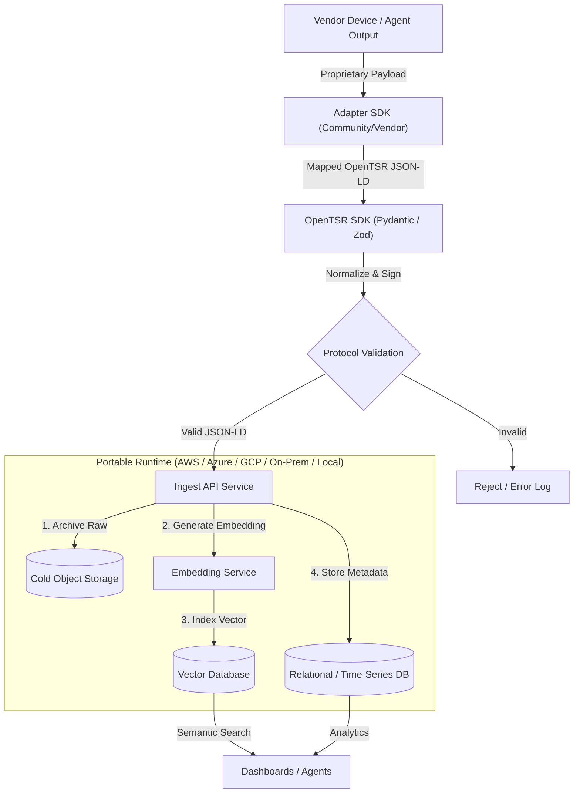

# ARCHITECTURE.md - OpenTSR System Design

## Overview
OpenTSR is a deployment-agnostic signal normalization and ingestion standard. The architecture consists of a public Adapter Hub, language SDK translators, and a portable ingest pattern that can run on any cloud or local infrastructure.

## System Diagram

## Component Definitions

1. Adapter Hub (`adapters/`)
Role: Public registry for vendor/community translators that map proprietary outputs into OpenTSR JSON-LD.

2. Translators (`sdk/`)
Role: Language SDKs that generate and validate compliant OpenTSR signals.

Current reference translators:
- Python (`sdk/python`) using Pydantic.
- TypeScript (`sdk/typescript`) using Zod.

3. Reference Ingest Stub
Role: Local contract test stub for vendors and contributors.

Reference implementation:
- `sdk/python/opentsr/reference_ingest.py` provides a local ingest contract used in tests.
- Invalid payloads return `400` style results.
- Valid payloads are persisted to cold storage and vector metadata is appended to a hot index.

4. Storage Roles
- Cold Object Storage: full raw JSON signal payload.
- Vector Database: embedding index for semantic retrieval.
- Relational/Time-Series DB: query metadata (time, origin, safety indicators).

---
