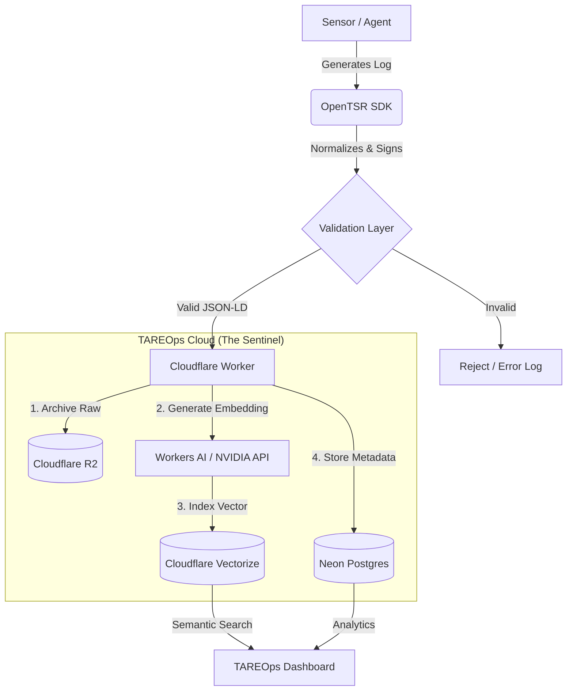

# ARCHITECTURE.md - OpenTSR System Design

## Overview
OpenTSR is a high-assurance signal normalization and ingestion standard. The architecture consists of a lightweight SDK (Client) and a serverless Ingestion Engine (Cloudflare).

## System Diagram

Component Definitions
1. The SDK (sdk/)
Role: Transforms raw disparate data (Cyber/Physical) into compliant OpenTSR JSON-LD.

Key Libs: Pydantic (Python), Zod (TypeScript).

2. The Sentinel (Ingest Worker)
Role: The Gatekeeper.

Function:

Validates Schema (JSON Schema).

Checks Cryptographic Signature (Veracity).

Routes to storage (Hot/Cold).

Reference implementation:

- `sdk/python/opentsr/ingest.py` provides the ingest contract used in tests.
- Invalid payloads return `400` style results.
- Valid payloads are persisted to cold storage and vector metadata is appended to a hot index.

3. Storage Layer
Cold: Cloudflare R2 (Object Storage). Stores the full raw JSON payload.

Hot: Cloudflare Vectorize. Stores the 1536-dim embedding for RAG.

Meta: Neon (Serverless Postgres). Stores relational tags (Time, Origin, Safety Score).

---
